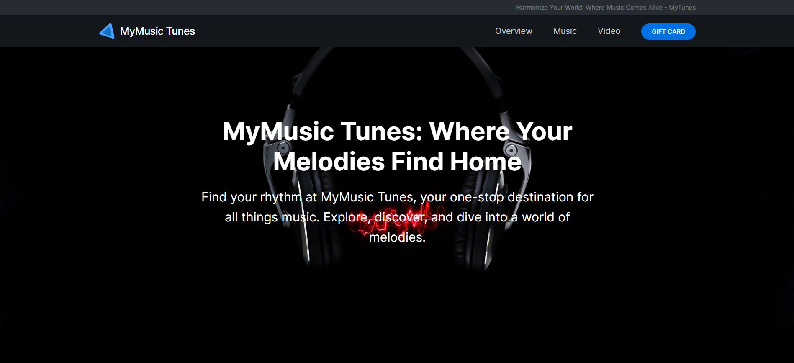
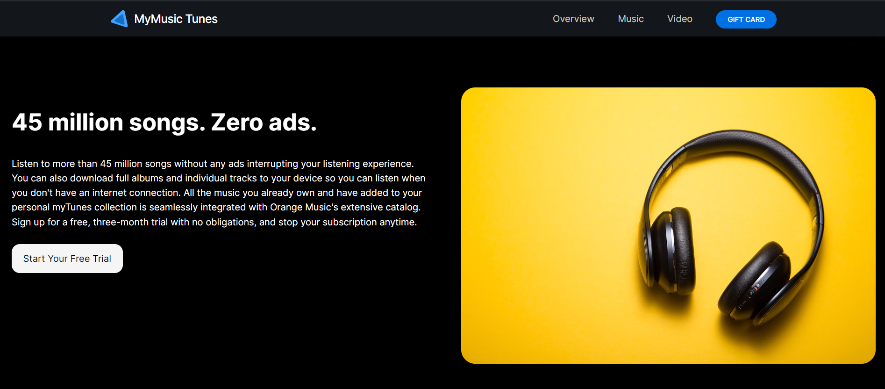
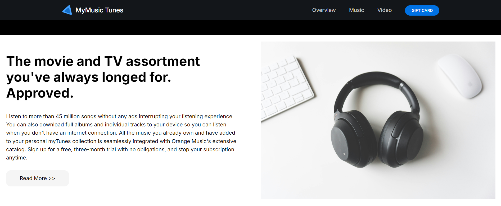

<<<<<<< HEAD
# MyMusic Tunes

MyMusic Tunes is a website designed to enhance your music experience. Whether you are looking to listen to songs, watch music videos, or purchase gift cards for your loved ones, MyMusic Tunes offers a clean, responsive design that works across devices. This project was developed using modern HTML, CSS, and JavaScript.

## Features
- **Responsive Navigation Bar:** Smooth and responsive navigation with a fixed header.
- **Music Overview Section:** Explore a vast library of over 45 million songs with no ads.
- **Video Section:** A dedicated area for videos and visual content.
- **Gift Card Integration:** Option to purchase and redeem gift cards for premium features.
- **Responsive Design:** Optimized for mobile and desktop views.
- **Custom Styling:** Beautiful and minimal UI for a user-friendly experience.

## Technologies Used
- **HTML5**: For the structure and layout of the web pages.
- **CSS3**: For the design and responsive styling.
- **JavaScript**: For interactive elements, including the navigation menu toggle.
- **Font Awesome**: For icons used across the project.
- **Google Fonts**: Used for the 'Inter' font family.

**Live Demo**:
You can try Live Demo, [Click here :)]()

**Screenshots**: Some of Live Screenshots 

    
      
    
      
    

=======
# My Tunes

      
    

## Live Version

<!-- **[Click here! :)](file:///D:/Major%20Projects/Hackathon%201.0/1.%20My%20Tunes/index.html)** -->

## Project Overview

A music website named "My Tunes" featuring seamless streaming, personalized playlists, and artist interaction. The site utilizes modern design principles and responsive layout techniques with Flexbox, Grid, and Media Queries.
>>>>>>> 4161b95bfbf8352a6a78d11798358cc55ab4d8f2
